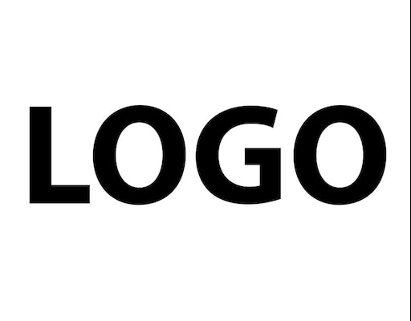

# Бургер-меню

Источник: видео "Правильное адаптивное меню бургер на HTML CSS и jQuery. Мобильное меню туториал // Как это сделать?" 
https://vk.com/im/convo/19460369?entrypoint=list_all&z=video-125918837_456239140%2Fdf0522be9aedf3adbc

1. создаем создаем файлы index.html, style.css, script.js в папке проекта

2. в файле index.html готовим шаблон

```html
<!--сообщаем браузеру, как стоит обрабатывать эту страницу-->
<!DOCTYPE html>
<!--оболочка документа, указываем язык содержимого-->
<html lang="ru">
<!--заголовок страницы, контейнер для других важных данных (не отображается)-->
<head>
    <!--заголовок страницы в браузере-->
    <title></title>
    <!--подключаем CSS-->
    <link rel="stylesheet" href="style.css">
    <!--кодировка страницы-->
    <meta charset="utf-8">
</head>
<!--отображаемое тело страницы-->
<body>
<!--оболочка для демонстрации-->
<div class="wrapper">
    <!--контент-->

</div>
<!--подключаем jQuery-->
<script src="https://code.jquery.com/jquery-3.4.1.slim.min.js"></script>
<!--подключаем файл JS скриптов-->
<script src="script.js"></script>
</body>
</html>
```

3. в файле index.html вставляем название проекта в title раздела head

```html
<title>Адаптивное меню, меню бургер</title>
```

4. в файле index.html в разделе body класса wrapper создаем подзаголовки для меню

```html
<header class="header">
    <div class='container'> <!--container - ограничит ширину нашей контентной части-->
        <div class="header_body">
            <a href="#" class="header_logo">
                
            </a> <!--логотип-->
            <div class="header_burger">
                <span></span> <!--span - нужен для рисования бургера-->
            </div>
            <nav class="header_menu"> <!--nav - меню бургера-->
                <ul class="header_list">
                    <li>
                        <a href="" class="header_link">Главная</a>
                    </li>
                    <li>
                        <a href="" class="header_link">Уроки</a>
                    </li>
                    <li>
                        <a href="" class="header_link">Шпаргалки</a>
                    </li>
                    <li>
                        <a href="" class="header_link">Полезное</a>
                    </li>
                    <li>
                        <a href="" class="header_link">О канале</a>
                    </li>
                    <li>
                        <a href="" class="header_link">Контакты</a>
                    </li>
                </ul>
            </nav>
        </div>
    </div>
</header>
```

5. в файле index.html в разделе body класса wrapper создаем контент (текст можно взять, сгенерировав на сайте 
https://loremipsum.io)

```html
<div class="content">
    <div class='container'>
        <div class="content_text">
            <p>
                Lorem ipsum odor amet, consectetuer adipiscing elit. Id ipsum purus congue egestas tristique elit lobortis habitasse. Dui nam finibus nec ac finibus, proin velit sed. Elementum id blandit eleifend at imperdiet leo suspendisse per. Venenatis quisque proin fermentum et nulla mollis. Ex tellus hendrerit ut aptent id purus elementum potenti. Magnis posuere facilisi nullam taciti arcu ridiculus. Parturient viverra netus pellentesque enim habitant integer. Tincidunt laoreet dis vehicula turpis malesuada commodo morbi. Pretium vitae lacinia leo odio suscipit, mi proin urna?

                Posuere cubilia vel ac eget blandit mi. Risus adipiscing risus duis vestibulum per donec adipiscing elementum? Ullamcorper vehicula sapien lacinia urna, porttitor in. Nostra a lobortis sollicitudin interdum nascetur; per torquent fringilla. Donec metus tempor id a ultricies eleifend sed diam. Mattis sollicitudin placerat sagittis erat consectetur morbi pharetra. Hendrerit inceptos vulputate litora elementum neque mattis id risus tellus. Gravida pharetra platea curabitur tellus taciti quam.

                Maecenas aenean amet morbi vitae class. Fringilla nulla turpis tortor tortor scelerisque taciti. Facilisis mauris natoque dolor commodo penatibus porttitor lacinia phasellus. Mi ac at massa habitant metus orci. Non donec massa; ex consequat diam cursus. Nisi eu scelerisque est interdum iaculis porta.

                Ad elit eu metus tempus massa. Sagittis tristique eget nisi dictum malesuada aptent elit morbi. Nisl sodales magna iaculis felis vivamus augue. Aliquet hac quis eleifend imperdiet augue augue hendrerit magnis neque. Tempus morbi suspendisse bibendum tellus lectus habitasse eu. Feugiat urna adipiscing scelerisque auctor euismod aptent ligula.

                Magnis elit cras laoreet lobortis habitasse. Eleifend sapien nostra nullam risus dui dolor convallis erat. Sapien turpis lectus mi venenatis parturient scelerisque dis maecenas. Vitae luctus suspendisse imperdiet sollicitudin finibus nullam dolor fermentum. Arcu montes semper; suscipit netus risus semper praesent. Neque parturient per libero nec massa feugiat duis.
            </p>
            <p>
                Lorem ipsum odor amet, consectetuer adipiscing elit. Id ipsum purus congue egestas tristique elit lobortis habitasse. Dui nam finibus nec ac finibus, proin velit sed. Elementum id blandit eleifend at imperdiet leo suspendisse per. Venenatis quisque proin fermentum et nulla mollis. Ex tellus hendrerit ut aptent id purus elementum potenti. Magnis posuere facilisi nullam taciti arcu ridiculus. Parturient viverra netus pellentesque enim habitant integer. Tincidunt laoreet dis vehicula turpis malesuada commodo morbi. Pretium vitae lacinia leo odio suscipit, mi proin urna?

                Posuere cubilia vel ac eget blandit mi. Risus adipiscing risus duis vestibulum per donec adipiscing elementum? Ullamcorper vehicula sapien lacinia urna, porttitor in. Nostra a lobortis sollicitudin interdum nascetur; per torquent fringilla. Donec metus tempor id a ultricies eleifend sed diam. Mattis sollicitudin placerat sagittis erat consectetur morbi pharetra. Hendrerit inceptos vulputate litora elementum neque mattis id risus tellus. Gravida pharetra platea curabitur tellus taciti quam.

                Maecenas aenean amet morbi vitae class. Fringilla nulla turpis tortor tortor scelerisque taciti. Facilisis mauris natoque dolor commodo penatibus porttitor lacinia phasellus. Mi ac at massa habitant metus orci. Non donec massa; ex consequat diam cursus. Nisi eu scelerisque est interdum iaculis porta.

                Ad elit eu metus tempus massa. Sagittis tristique eget nisi dictum malesuada aptent elit morbi. Nisl sodales magna iaculis felis vivamus augue. Aliquet hac quis eleifend imperdiet augue augue hendrerit magnis neque. Tempus morbi suspendisse bibendum tellus lectus habitasse eu. Feugiat urna adipiscing scelerisque auctor euismod aptent ligula.

                Magnis elit cras laoreet lobortis habitasse. Eleifend sapien nostra nullam risus dui dolor convallis erat. Sapien turpis lectus mi venenatis parturient scelerisque dis maecenas. Vitae luctus suspendisse imperdiet sollicitudin finibus nullam dolor fermentum. Arcu montes semper; suscipit netus risus semper praesent. Neque parturient per libero nec massa feugiat duis.
            </p>
        </div>
    </div>
</div>
```

6. в файле style.css вставляем шаблон

```css
/*Обнуление*/
*,*:before,*:after{
    padding: 0;
    margin: 0;
    border: 0;
    box-sizing: border-box;
}
html,body{
    height: 100%;
}
/*Стили для демонстрации*/
.wrapper{
    
}

/*Основные стили*/
```

7. в файле style.css добавляем все классы из html

```css
.header {}
.header_body {}
.header_logo {}
.header_burger {}
.header_menu {}
.header_list {}
.header_link {}

.content {}
.content_text {}
```

8. в файле style.css заголовок-шапка меню

```css
.header { /*фиксируем, чтобы шапка меню всегда была сверху*/
    position: fixed;
    width: 100%;
    top: 0;
    left: 0;
    z-index: 50; /*большой, чтобы накрыло весь контент*/
}
```
9. в файле style.css создаем плашку для header, для этого создаем псевдоэлемент before на весь размер нашей шапочки меню

```css
.header:before{
    content: '';
    position: absolute;
    top: 0;
    left: 0;
    width: 100%;
    height: 100%;
    background-color: #5e5373
}
```

10. в файле style.css вытаскиваем наверх контентную часть шапки

```css
.header_body {
    position: relative;
    z-index: 2;
    display: flex;
    justify-content: space-between; /*чтобы раскидать наши flex элементы по сторонам*/
    height: 80px;
    align-items: center;
}
```

11. в файле style.css ограничиваем контентную часть по ширине

```css
.container{
    max-width: 1180px;
    margin: 0px auto;
    padding: 0px 10px;
}
```

12. в файле style.css верстка самого меню

```css
.header_list {
    display: flex;
}
.header_list li{
    list-style: none;
    margin: 0px 0px 0px 20px;
}
```

13. в файле style.css стиль для ссылки

```css
.header_link {
    color: #fff;
    text-transform: uppercase;
    font-size: 18px;
    text-decoration: none;
}
```

14. в файле style.css стиль для логотипа

```css
.header_logo {
    flex: 0 0 60px;
    border-radius: 50%; /*делаем логотип круглым*/
    overflow: hidden;
}

.header_logo img{
    max-width: 100%; /*если картинка логотипа будет больше, то она подстроитсяя под размер*/
    display: block; /*по умолчанию у картинок есть отступ, мы его убираем*/
}
```

15. в файле style.css стиль шрифта и контентной части

```css
.content {
    padding: 100px 0px 0px 0px; /*чтобы шапочка не накрыла часть контента. Это юзабилити - удобство использования*/
}
.content_text {
    font-size: 18px;
    line-height: 25px;
}
.content_text p{
    margin: 0px 0px 20px 0px;
}
```

16. в файле index.html адаптивим контентную часть в разделе head

```html
<meta name="viewport" content="width=device-width">
```

17. в файле style.css адаптивим меню, т.е. пишем разрешение, при котором надо прятать меню в бургер
Мобильное разрешение, это все, что меньше 768px (разрешение планшета 768*1024px).
Начнем со стилизации бургера

```css
.header_burger {
    display: none; /*для начала скрыть от всех разрешений, которые выше 767px*/
}

@media (max-width: 767px) { /*media запрос, в котором работаем с бургером*/
    .header_burger {
        display: block;
        position: relative;
        width: 30px;
        height: 20px;
    }
    .header_burger span{
        position: absolute;
        background-color: #fff;
        left: 0;
        width: 100%;
        height: 2px;
        top: 9px;
    }
    .header_burger:before,  /*псевдостили для рисования бургера - линии, общие для before и after*/
    .header_burger:after{
        content: '';
        background-color: #fff;
        position: absolute;
        width: 100%;
        height: 2px;
        left: 0;
    }
    .header_burger:before{
        top: 0;
    }
    .header_burger:after{
        bottom: 0;
    }
}
```

18. в файле style.css адаптивим меню для разрешения меньше 768px

```css
/*.header:before добавляем*/
z-index: 2; /*чтобы меню открывалось под этой плашкой*/

/*удаляем из .header_body затычку, которая добавлялась для начала верстки*/
z-index: 2;

/*в .header_logo добавляем*/
position: relative;
z-index: 3;

/*в @media в .header_burger добавляем*/
z-index: 3;

/*в @media добавляем .header_menu*/
.header_menu {
    position: fixed;
    top: 0;
    left: 0;
    width: 100%;
    height: 100%;
    background-color: #18b5a4;
    padding: 70px 10px 20px 10px;
}

/*в @media добавляем .header_body - адаптивим высоту шапочки - не 80px, а будет 50px*/
.header_body {
    height: 50px;
}

/*в @media добавляем .header_logo - адаптивим высоту логотипа к шапочке - не 60px, а будет 40px*/
.header_logo {
    flex: 0 0 40px;
}

/*в .header_list добавляем*/
position: relative;
z-index: 2;

/*переносим .header_list, .header_list li, .header_link - чтобы они были над @media, для медиазапросов к ним*/
.header_list {
    display: flex;
    position: relative;
    z-index: 2;
}
.header_list li{
    list-style: none;
    margin: 0px 0px 0px 20px;
}
.header_link {
    color: #fff;
    text-transform: uppercase;
    font-size: 18px;
    text-decoration: none;
}

/*добавляем .header_list в @media*/
.header_list {
    display: block; /*отключаем дисплей фильтр*/
}

/*добавляем .header_list li в @media*/
.header_list li{ /*нужны отступы уже не влево, а вниз*/
    margin: 0px 0px 20px 0px;
}
```

19. в файле script.js вставляем шаблон

```js
$(document).ready(function () {

});
```

20. в файле script.js добавляем нажатие кнопки бургера и раскрытия/скрытия меню в нем

```js
$(document).ready(function () { //нам нужно, чтобы при нажатиии на header_burger что-то происходило
    $('.header_burger').click(function (event){ //вешаем на класс .header_burger событие click
        $('.header_burger,.header_menu').toggleClass('active');
        //добавляем новый класс к меню и бургеру при нажатии, а потом убираем при повторном нажатии
        //можно увидеть в DevTools
    });
});
```

21. в файле style.css в @media добавляем отображение крестика вместо линий при нажатии бургера

```css
/*делаем из бургера крестик при развертывании меню*/

.header_burger.active:before{ /*линия крестика - сверху слева к снизу справа*/
    transform: rotate(45deg);
    top: 9px;
}
.header_burger.active:after{ /*линия крестика - сверху справа к снизу слева*/
    transform: rotate(-45deg);
    bottom: 9px;
}
.header_burger.active span{ /*линия крестика - убираем горизонтальную линию по центру*/
    transform: scale(0);
}
```

22. в файле style.css добавляем строку в .header_burger span и в .header_burger:after для плавного 
перехода линий бургера в крестик и обратно при нажатии

```css
transition: all 0.3s ease 0s;
```

23. в файле style.css в @media в .header_menu прячем меню в бургер

```css
top: 0; 
/*заменяем на*/
top: -100%;
```

24. в файле style.css в @media создаем .header_menu.active

```css
.header_menu.active{
    top: 0; /*чтобы меню появлялось при нажатии на бургер*/
}
```

25. в файле style.css в @media в .header_menu для плавной анимации разворота меню при нажатии на бургер

```css
transition: all 0.3s ease 0s;
```

26. в файле style.css создаём новый @media, чтобы подвинуть контент

```css
/*подвинуть контент*/
@media (max-width: 767px) {
    .content {
        padding: 70px 0px 0px 0px;
    }
}
```

27. чтобы контент не скроллился при развернутом меню бургера

А) в файле style.css
```js
$('body').toggleClass('lock'); //при открытом меню блокируется контент + в style.css добавлен body в 1ый @media
```
Б) в файле script.js
```css
body.lock{
    overflow: hidden;
}
```

28. в файле style.css в 1й @media добавляем .header_link в @media, 
чтобы адаптировать к устройствам названия ссылок в меню.
Чтобы при развороте бургера можно листать меню, если не влезает в экран

```css
.header_link {
    font-size: 24px; /*увеличиваем шрифт в адаптивном меню*/
}
```
Добавляем в 1й @media в .header_menu строку
```css
overflow: auto;
```

# Итог

1. в файле style.css

```css
/*Обнуление*/
*,*:before,*:after{
    padding: 0;
    margin: 0;
    border: 0;
    box-sizing: border-box;
}
html,body{
    height: 100%;
}
/*Стили для демонстрации*/
.wrapper{

}

/*Основные стили*/

.container{
    max-width: 1180px;
    margin: 0px auto;
    padding: 0px 10px;
}

.header { /*фиксируем, чтобы шапка меню всегда была сверху*/
    position: fixed;
    width: 100%;
    top: 0;
    left: 0;
    z-index: 50; /*большой, чтобы накрыло весь контент*/
}
.header:before{
    content: '';
    position: absolute;
    top: 0;
    left: 0;
    width: 100%;
    height: 100%;
    background-color: #5e5373;
    z-index: 2; /*чтобы меню открывалось под этой плашкой*/
}

.header_body {
    position: relative;
    display: flex;
    justify-content: space-between; /*чтобы раскидать наши flex элементы по сторонам*/
    height: 80px;
    align-items: center;
}
.header_logo {
    flex: 0 0 60px;
    border-radius: 50%; /*делаем логотип круглым*/
    overflow: hidden;
    position: relative;
    z-index: 3;
}
.header_logo img{
    max-width: 100%; /*если картинка логотипа будет больше, то она подстроитсяя под размер*/
    display: block; /*по умолчанию у картинок есть отступ, мы его убираем*/
}

.header_burger {
    display: none; /*для начала скрыть от всех разрешений, которые выше 767px*/
}
.header_menu {}

.header_list {
    display: flex;
    position: relative;
    z-index: 2;
}
.header_list li{
    list-style: none;
    margin: 0px 0px 0px 20px;
}
.header_link {
    color: #fff;
    text-transform: uppercase;
    font-size: 18px;
    text-decoration: none;
}

@media (max-width: 767px) { /*media запрос, в котором работаем с бургером*/
    body.lock{
        overflow: hidden;
    }
    .header_body {
        height: 50px;
    }
    .header_logo {
        flex: 0 0 40px;
    }
    .header_burger {
        display: block;
        position: relative;
        width: 30px;
        height: 20px;
        z-index: 3;
    }
    .header_burger span{
        position: absolute;
        background-color: #fff;
        left: 0;
        width: 100%;
        height: 2px;
        top: 9px;
        transition: all 0.3s ease 0s;
    }
    .header_burger:before,  /*псевдостили для рисования бургера - линии, общие для before и after*/
    .header_burger:after{
        content: '';
        background-color: #fff;
        position: absolute;
        width: 100%;
        height: 2px;
        left: 0;
        transition: all 0.3s ease 0s;
    }
    .header_burger:before{
        top: 0;
    }
    .header_burger:after{
        bottom: 0;
    }

    /*делаем из бургера крестик при развертывании меню*/
    .header_burger.active:before{ /*линия крестика - сверху слева к снизу справа*/
        transform: rotate(45deg);
        top: 9px;
    }
    .header_burger.active:after{ /*линия крестика - сверху справа к снизу слева*/
        transform: rotate(-45deg);
        bottom: 9px;
    }
    .header_burger.active span{ /*линия крестика - убираем горизонтальную линию по центру*/
        transform: scale(0);
    }

    .header_menu {
        position: fixed;
        top: -100%;
        left: 0;
        width: 100%;
        height: 100%;
        overflow: auto;
        transition: all 0.3s ease 0s;
        background-color: #18b5a4;
        padding: 70px 10px 20px 10px;
    }

    .header_menu.active{
        top: 0; /*чтобы меню появлялось при нажатии на бургер*/
    }

    .header_list {
        display: block; /*отключаем дисплей фильтр*/
    }
    .header_list li{ /*нужны отступы уже не влево, а вниз*/
        margin: 0px 0px 20px 0px;
    }
    .header_link {
        font-size: 24px;
    }
}

.content {
    padding: 100px 0px 0px 0px; /*чтобы шапочка не накрыла часть контента. Это юзабилити - удобство использования*/
}
.content_text {
    font-size: 18px;
    line-height: 25px;
}
.content_text p{
    margin: 0px 0px 20px 0px;
}

/*подвинуть контент*/
@media (max-width: 767px) {
    .content {
        padding: 70px 0px 0px 0px;
    }
}
```

2. в файле script.js

```js
$(document).ready(function () { //нам нужно, чтобы при нажатиии на header_burger что-то происходило
    $('.header_burger').click(function (event){ //вешаем на класс .header_burger событие click
        $('.header_burger,.header_menu').toggleClass('active');
        //добавляем новый класс к меню и бургеру при нажатии, а потом убираем при повторном нажатии
        //можно увидеть в DevTools

        $('body').toggleClass('lock'); //при открытом меню блокируется контент + в style.css добавлен body в 1ый @media
    });
});
```

3. в файле index.html

```html
<!--сообщаем браузеру, как стоит обрабатывать эту страницу-->
<!DOCTYPE html>
<!--оболочка документа, указываем язык содержимого-->
<html lang="ru">
<!--заголовок страницы, контейнер для других важных данных (не отображается)-->
<head>
    <!--заголовок страницы в браузере-->
    <title>Адаптивное меню, меню бургер</title>
    <!--подключаем CSS-->
    <link rel="stylesheet" href="style.css">
    <!--кодировка страницы-->
    <meta charset="utf-8">
    <!--адаптив-->
    <meta name="viewport" content="width=device-width">
</head>
<!--отображаемое тело страницы-->
<body>
<!--оболочка для демонстрации-->
<div class="wrapper">  <!--wrapper - стандартная оболочка контента-->
    <!--контент-->
    <header class="header">
        <div class='container'> <!--container - ограничит ширину нашей контентной части-->
            <div class="header_body">
                <a href="#" class="header_logo">
                    
                </a> <!--логотип-->
                <div class="header_burger">
                    <span></span> <!--span - нужен для рисования бургера-->
                </div>
                <nav class="header_menu"> <!--nav - меню бургера-->
                    <ul class="header_list">
                        <li>
                            <a href="" class="header_link">Главная</a>
                        </li>
                        <li>
                            <a href="" class="header_link">Уроки</a>
                        </li>
                        <li>
                            <a href="" class="header_link">Шпаргалки</a>
                        </li>
                        <li>
                            <a href="" class="header_link">Полезное</a>
                        </li>
                        <li>
                            <a href="" class="header_link">О канале</a>
                        </li>
                        <li>
                            <a href="" class="header_link">Контакты</a>
                        </li>
                    </ul>
                </nav>
            </div>
        </div>
    </header>
    <div class="content">
        <div class='container'>
            <div class="content_text">
                <p>
                    Lorem ipsum odor amet, consectetuer adipiscing elit. Id ipsum purus congue egestas tristique elit lobortis habitasse. Dui nam finibus nec ac finibus, proin velit sed. Elementum id blandit eleifend at imperdiet leo suspendisse per. Venenatis quisque proin fermentum et nulla mollis. Ex tellus hendrerit ut aptent id purus elementum potenti. Magnis posuere facilisi nullam taciti arcu ridiculus. Parturient viverra netus pellentesque enim habitant integer. Tincidunt laoreet dis vehicula turpis malesuada commodo morbi. Pretium vitae lacinia leo odio suscipit, mi proin urna?

                    Posuere cubilia vel ac eget blandit mi. Risus adipiscing risus duis vestibulum per donec adipiscing elementum? Ullamcorper vehicula sapien lacinia urna, porttitor in. Nostra a lobortis sollicitudin interdum nascetur; per torquent fringilla. Donec metus tempor id a ultricies eleifend sed diam. Mattis sollicitudin placerat sagittis erat consectetur morbi pharetra. Hendrerit inceptos vulputate litora elementum neque mattis id risus tellus. Gravida pharetra platea curabitur tellus taciti quam.

                    Maecenas aenean amet morbi vitae class. Fringilla nulla turpis tortor tortor scelerisque taciti. Facilisis mauris natoque dolor commodo penatibus porttitor lacinia phasellus. Mi ac at massa habitant metus orci. Non donec massa; ex consequat diam cursus. Nisi eu scelerisque est interdum iaculis porta.

                    Ad elit eu metus tempus massa. Sagittis tristique eget nisi dictum malesuada aptent elit morbi. Nisl sodales magna iaculis felis vivamus augue. Aliquet hac quis eleifend imperdiet augue augue hendrerit magnis neque. Tempus morbi suspendisse bibendum tellus lectus habitasse eu. Feugiat urna adipiscing scelerisque auctor euismod aptent ligula.

                    Magnis elit cras laoreet lobortis habitasse. Eleifend sapien nostra nullam risus dui dolor convallis erat. Sapien turpis lectus mi venenatis parturient scelerisque dis maecenas. Vitae luctus suspendisse imperdiet sollicitudin finibus nullam dolor fermentum. Arcu montes semper; suscipit netus risus semper praesent. Neque parturient per libero nec massa feugiat duis.
                </p>
                <p>
                    Lorem ipsum odor amet, consectetuer adipiscing elit. Id ipsum purus congue egestas tristique elit lobortis habitasse. Dui nam finibus nec ac finibus, proin velit sed. Elementum id blandit eleifend at imperdiet leo suspendisse per. Venenatis quisque proin fermentum et nulla mollis. Ex tellus hendrerit ut aptent id purus elementum potenti. Magnis posuere facilisi nullam taciti arcu ridiculus. Parturient viverra netus pellentesque enim habitant integer. Tincidunt laoreet dis vehicula turpis malesuada commodo morbi. Pretium vitae lacinia leo odio suscipit, mi proin urna?

                    Posuere cubilia vel ac eget blandit mi. Risus adipiscing risus duis vestibulum per donec adipiscing elementum? Ullamcorper vehicula sapien lacinia urna, porttitor in. Nostra a lobortis sollicitudin interdum nascetur; per torquent fringilla. Donec metus tempor id a ultricies eleifend sed diam. Mattis sollicitudin placerat sagittis erat consectetur morbi pharetra. Hendrerit inceptos vulputate litora elementum neque mattis id risus tellus. Gravida pharetra platea curabitur tellus taciti quam.

                    Maecenas aenean amet morbi vitae class. Fringilla nulla turpis tortor tortor scelerisque taciti. Facilisis mauris natoque dolor commodo penatibus porttitor lacinia phasellus. Mi ac at massa habitant metus orci. Non donec massa; ex consequat diam cursus. Nisi eu scelerisque est interdum iaculis porta.

                    Ad elit eu metus tempus massa. Sagittis tristique eget nisi dictum malesuada aptent elit morbi. Nisl sodales magna iaculis felis vivamus augue. Aliquet hac quis eleifend imperdiet augue augue hendrerit magnis neque. Tempus morbi suspendisse bibendum tellus lectus habitasse eu. Feugiat urna adipiscing scelerisque auctor euismod aptent ligula.

                    Magnis elit cras laoreet lobortis habitasse. Eleifend sapien nostra nullam risus dui dolor convallis erat. Sapien turpis lectus mi venenatis parturient scelerisque dis maecenas. Vitae luctus suspendisse imperdiet sollicitudin finibus nullam dolor fermentum. Arcu montes semper; suscipit netus risus semper praesent. Neque parturient per libero nec massa feugiat duis.
                </p>
            </div>
        </div>
    </div>
</div>
<!--подключаем jQuery--> <!--jQuery - если он уже есть в проекте-->
<script src="https://code.jquery.com/jquery-3.4.1.slim.min.js"></script>
<!--подключаем файл JS скриптов-->
<script src="script.js"></script>
</body>
</html>
```